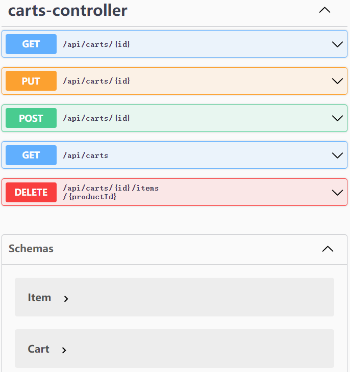
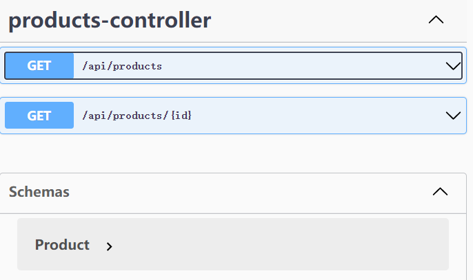
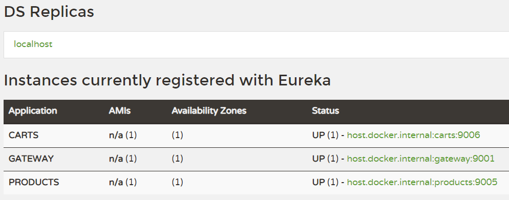
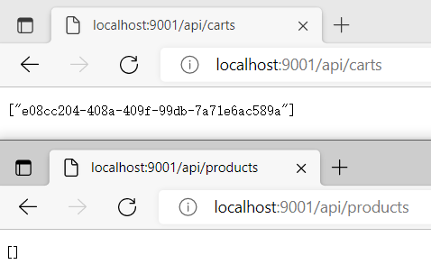

# RESTful microPoS 

实现了产品和购物车服务（带ehcache），以及微服务的服务发现与网关（带断路器）。

- 使用 Gradle 构建
- 使用 Springdoc 生成 OpenAPI 文档和 Swagger UI
- 使用 Eureka 提供微服务基础设施

> 完整项目参见 [micro-pos](https://github.com/StardustDL/micro-pos)

## 接口

购物车服务 OpenAPI：

产品服务 OpenAPI：

## 微服务基础设施

## Gateway 服务调用

## Description

请参考spring-petclinic-rest/spring-petclinic-microserivces 将aw04的webpos项目改为rest风格的微服务架构
（至少包含产品管理服务pos-products和购物车管理服务pos-carts以及discovery/gateway等微服务架构下需要的基础设施服务）。具体要求包括：

1. 请使用OpenAPI的定义每个服务的rest接口（参考pos-products）
2. 请使用ehcache管理缓存；
3. 请注意使用断路器等机制；
4. 有兴趣的同学可自学一些reactjs或vuejs等为microPoS开发一个前端。
